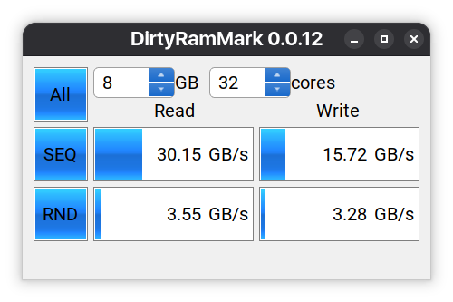

# DirtyRamMark - Memory Bandwidth Benchmark Tool



**DirtyRamMark** is a professional memory bandwidth benchmarking application that measures RAM performance with different access patterns. It provides accurate measurements of both sequential and random memory access speeds, helping developers and system administrators understand memory subsystem performance.

## Features

### 🚀 **Comprehensive Memory Testing**
- **Sequential (SEQ) Tests**: Measure memory bandwidth with linear access patterns (cache-friendly)
- **Random (RND) Tests**: Measure memory bandwidth with random access patterns (cache-unfriendly)
- **All Tests**: Run both sequential and random tests in a single operation

### 📊 **Detailed Performance Metrics**
- **Read Bandwidth**: Measures how fast data can be read from memory
- **Write Bandwidth**: Measures how fast data can be written to memory
- **Real-time Progress**: Visual progress bars for each test phase
- **GB/s Measurements**: Results displayed in gigabytes per second

### ⚙️ **Configurable Test Parameters**
- **Buffer Size**: Adjustable from 1GB to large memory allocations
- **Thread Count**: Automatic detection of CPU cores with manual override
- **Multi-threaded**: Parallel testing across all available CPU cores

### 🎯 **Advanced Technical Features**
- **Template-based architecture**: Clean separation of test patterns
- **Thread-local random generators**: Avoid contention in random tests
- **Progress tracking**: 0-50% for read tests, 50-100% for write tests
- **AUI Framework**: Modern C++ GUI with responsive design

## Usage

### Running Tests

1. **Configure Test Parameters**:
   - Set buffer size (in GB) using the number picker
   - Adjust thread count (defaults to CPU core count)

2. **Choose Test Mode**:
   - **All Button**: Run both sequential and random tests (shows overall progress)
   - **SEQ Button**: Run only sequential memory access tests
   - **RND Button**: Run only random memory access tests

3. **Monitor Progress**:
   - Each test shows progress from 0-50% (read phase) and 50-100% (write phase)
   - "All" test shows combined progress across all four phases

4. **View Results**:
   - Read and write bandwidth displayed separately for each test type
   - Results shown in GB/s for easy comparison

### Understanding Results

- **SEQ Results**: Represent best-case memory performance (cache hits)
- **RND Results**: Represent worst-case memory performance (cache misses)
- **Typical Pattern**: SEQ bandwidth > RND bandwidth due to cache effects
- **Real-world Relevance**: Applications with good locality benefit from SEQ patterns, while random access patterns show memory subsystem limits

## Building from Source

### Prerequisites
- CMake 3.16 or higher
- C++20 compatible compiler
- Git

### Build Instructions

```bash
# Clone the repository
git clone <repository-url>
cd dirtymemmark

# Configure with CMake
cmake -B build -DCMAKE_BUILD_TYPE=Release

# Build the project
cmake --build build --parallel

# Run the application
./build/bin/dirty_ram_mark
```

### Development Build

For development with debugging symbols:

```bash
cmake -B build -DCMAKE_BUILD_TYPE=RelWithDebInfo
cmake --build build --parallel
```

## Technical Details

### Architecture
- **Test Patterns**: Template-based implementation for SEQ and RND access
- **Memory Access**: Uses `glm::dvec4` buffers (32 bytes per element)
- **Progress Calculation**: Linear interpolation based on bytes processed
- **Bandwidth Formula**: `buffer_size_bytes / elapsed_time`

### Threading Model
- Each test divides work across configured thread count
- Thread-local random number generators for RND tests
- Progress updates synchronized to main UI thread

### Performance Considerations
- Buffer allocation happens once per test run
- Random index generation optimized to minimize overhead
- Progress updates batched to reduce UI thread load

## Project Structure

```
dirtymemmark/
├── CMakeLists.txt          # Build configuration
├── src/
│   └── main.cpp           # Main application logic and UI
├── assets/
│   └── img/               # Application assets
├── build/                 # Build directory (generated)
└── README.md             # This file
```

## Contributing

1. Fork the repository
2. Create a feature branch
3. Make your changes
4. Ensure code builds without errors
5. Submit a pull request

### Code Style
- Follow existing code patterns
- Use descriptive variable names
- Add comments for complex logic
- Maintain template-based architecture for test patterns

## Acknowledgments

- Built with the [AUI Framework](https://github.com/aui-framework/aui)
- Uses modern C++20 features
